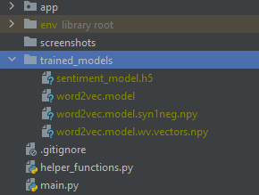

## Sentiment Analysis Using Deep Learning Backend
### How to use
1. Create an environment and install all the required libraries
   * tensorflow
   * pandas
   * numpy
   * gensim
   * nltk
   * fastapi
   * uvicorn
   * starlette
2. Train The model using the notebooks available at `https://github.com/niranjanblank/TweetSentimentAnalysisUsingDeepLearning`
    or
    Download the trained models from this google drive link `https://drive.google.com/file/d/16WRxmeGHH5eFE-aBAaQDhGxVOToM-Lu1/view?usp=sharing`
3. Save the trained model in trained_models directory in the structure shown below
    
4. Run `python manage.py` to start the server
5. You can access the docs related to the routes by visiting `/docs`
